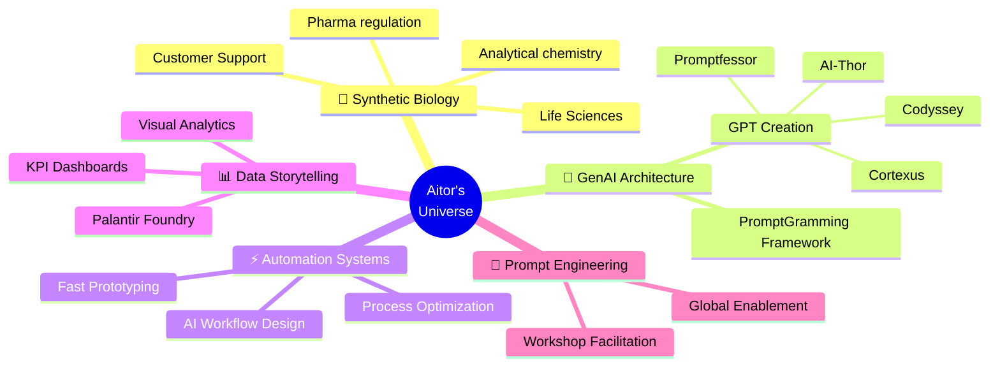

### ⚡ About Me  
👋 Hi, I'm **Aitor** — an AI workflow architect blending molecular precision with digital transformation.  
I turn research insight into automation pipelines, connecting *synthetic biology → analytics → GenAI*.  

💊 **Life Sciences × AI Systems**

I design and scale Generative AI ecosystems in regulated pharma environments, with measured impact on productivity.

20+ GPT micro-apps deployed across teams (400+ active users)

End-to-end GenAI ecosystem (RAG, copilots, dashboards, telemetry)

2.5× productivity gain, measured by task throughput and time-on-task reduction after adoption

KPI & data storytelling dashboards for operational and leadership decisions

Global enablement workshops on prompt engineering and GenAI workflows

🌐 **What drives me:** curiosity, elegant systems, and the thrill of making tech feel human.  

---

### 💻 Core Projects
🧩 **[PromptGramming](https://github.com/rm2thaddeus/promptgramming)** — framework to structure thoughts and shape them into production code  
⚡ [AI-Thor](https://chatgpt.com/g/g-ZCd2v1FNw-ai-thor) — wielding his hammer to squash AI problems  
🧠 [Cortexus](https://chatgpt.com/g/g-HMbi7hVLd-cortexus) — a being made to create GPTs with personality  
🎓 [Promptfessor](https://chatgpt.com/g/g-jq5mdQueS-promptfessor) — a long prompt to make other prompts  
🚀 [Codyssey](https://chatgpt.com/g/g-OoVYdjIh0-codyssey) — embark on your coding journey with discovery-driven development  
📸 [Pixel Detective](https://github.com/rm2thaddeus/Pixel_Detective) — multi-modal RAG for visual data analysis  

---

### 🧠 My Toolkit  

