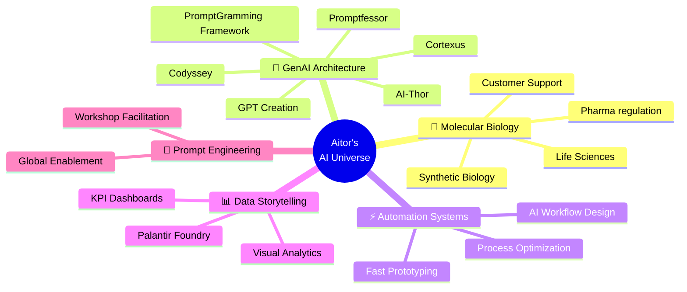

<!-- Typing Animation -->

---

### ⚡ About Me  
👋 Hi, I'm **Aitor** — an AI workflow architect blending molecular precision with digital transformation.  
I turn research insight into automation pipelines, connecting *synthetic biology → analytics → GenAI*.  

💊 **Life Sciences + AI Systems**  
In the **pharma industry**, I build generative AI ecosystems:  
- 20+ GPT assistants deployed (400+ users)  
- Dashboards for KPI storytelling  
- Process automation saving +45h hours yearly/user
- Global enablement workshops on prompt design  

🌐 **What drives me:** curiosity, elegant systems, and the thrill of making tech feel human.  

---

### 💻 Core Projects
🧩 **[PromptGramming](https://github.com/rm2thaddeus/promptgramming)** — framework to structure thoughts and shape them into production code  
⚡ [AI-Thor](https://chatgpt.com/g/g-ZCd2v1FNw-ai-thor) — wielding his hammer to squash AI problems  
🧠 [Cortexus](https://chatgpt.com/g/g-HMbi7hVLd-cortexus) — a being made to create GPTs with personality  
🎓 [Promptfessor](https://chatgpt.com/g/g-jq5mdQueS-promptfessor) — a long prompt to make other prompts  
🚀 [Codyssey](https://chatgpt.com/g/g-OoVYdjIh0-codyssey) — embark on your coding journey with discovery-driven development  
📸 [Pixel Detective](https://github.com/rm2thaddeus/Pixel_Detective) — multi-modal RAG for visual data analysis  

---

### 🧠 AI Ecosystem Mindmap  

---

### 🎯 Key Outcomes  
- **20+ GPT assistants** deployed across pharma industry (400+ users)  
- **45+ hours per person** saved annually through process automation
- **Global enablement workshops** on prompt design and AI systems

---

### 🐍 Contribution Snake  

---

🌌 *Creating bridges between human insight and machine intelligence.*

